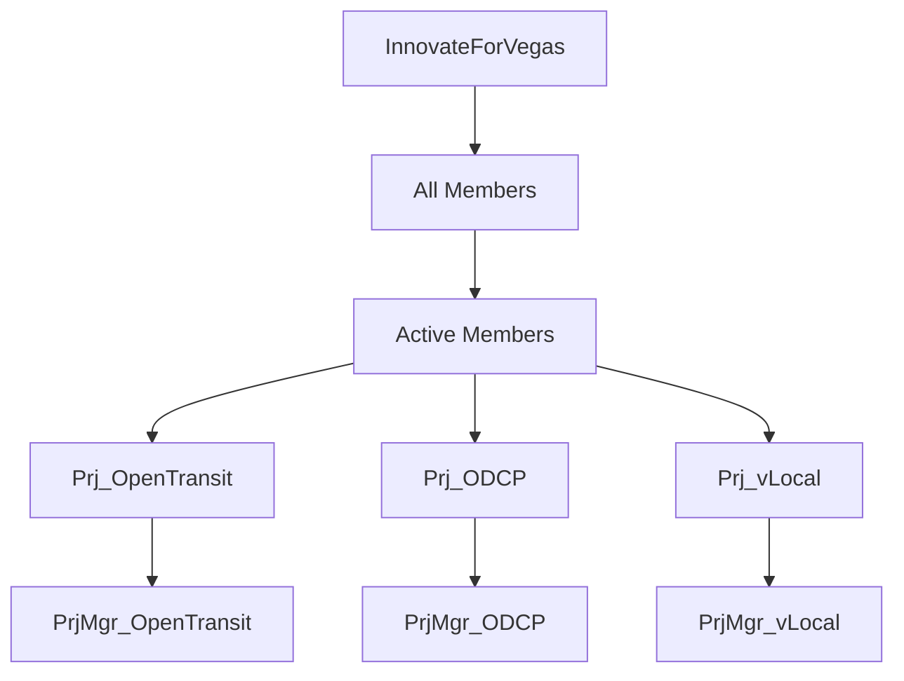

<!--
 Copyright (C) 2022 Innovate for Vegas Foundation
 
 This file is part of doc-org-howtos.
 
 doc-org-howtos is free software: you can redistribute it and/or modify
 it under the terms of the GNU General Public License as published by
 the Free Software Foundation, either version 3 of the License, or
 (at your option) any later version.
 
 doc-org-howtos is distributed in the hope that it will be useful,
 but WITHOUT ANY WARRANTY; without even the implied warranty of
 MERCHANTABILITY or FITNESS FOR A PARTICULAR PURPOSE.  See the
 GNU General Public License for more details.
 
 You should have received a copy of the GNU General Public License
 along with doc-org-howtos.  If not, see <http://www.gnu.org/licenses/>.
-->

# The Innovate for Vegas Foundation Project Org Chart

Due to the volunteer nature of the cohort of workers and contributors to our projects, it is important to know who is working on what and when, and who might no longer be working on what, and when. If we have no idea who is on our team and what they are up to, it will be easy to assume that someone else is doing something, and nobody will be happy to learn that that is not the case. Let us organize our efforts!

## GitHub Teams

We are making use of GitHub Teams to organize people, and to organize repository access per project team.

[GitHub Doc: Teams](https://docs.github.com/en/organizations/organizing-members-into-teams/about-teams)

As of this writing, the basic org structure in the GitHub Teams universe is something like this example:

The *Active Members* team is all members of Innovate for Vegas Foundation volunteers who are actively working on projects in one way or another. The *All Members* team contains all *Active Members* as well as members of the former Code for Vegas Brigade (up until February 2016) who may or may not be reachable.

Prj_ teams can write to repositories that are a part of the corresponding project, which means they can commit to the project following a workflow that the team agrees upon. This may be use of pull requests, or it may be a ci/cd style committing to the main branch directly, or perhaps something else. It is important to agree on this scheme as a team!

PrjMgr_ teams have more access to the repositories so they can perform some administrative and management tasks.

Active members are always welcome to participate in all projects, but they may not be tracking the particular workflow preferences of a given team. Ideally they will fall back to using a now-standard pull or merge request approach, so that their contributions from outside of the team workflow can be considered safely.

## Real Life vs GitHub

GitHub is a tool. It is a widely-used and very-reasonably-priced tool, worth becoming familiar with, but it is only a tool. The Innovation for Vegas Foundation organization chart is made up of people, of varying levels of experience and skill in particular areas (you may be highly skilled at one thing but just learning some new thing, which is completely fine!). We hope you can make use of the tools, like GitHub and its Discussions and [Issues](issues.md) regardless of whether you are a Coder, and integrate these with more common tools such as email, chat rooms (like Matrix and Discord), video and audio interactions, and in-person collaboration and discussion, whether at an organization-wide in-person meetup, or whenever your team can converge at an agreeable place and time.

It should go without saying, being a part of an organization in the bigger picture, and as part of a time closer to your project(s) along your career path, is going to be common, it is worth developing these skills at all levels and the ability to make use of common tools will only improve these skills. GitHub is not the answer to every question, but it is a reasonable way to learn and it will serve the needs of our teams for the near term.

So be sure to sign up for a GitHub account if you don't already have one!
