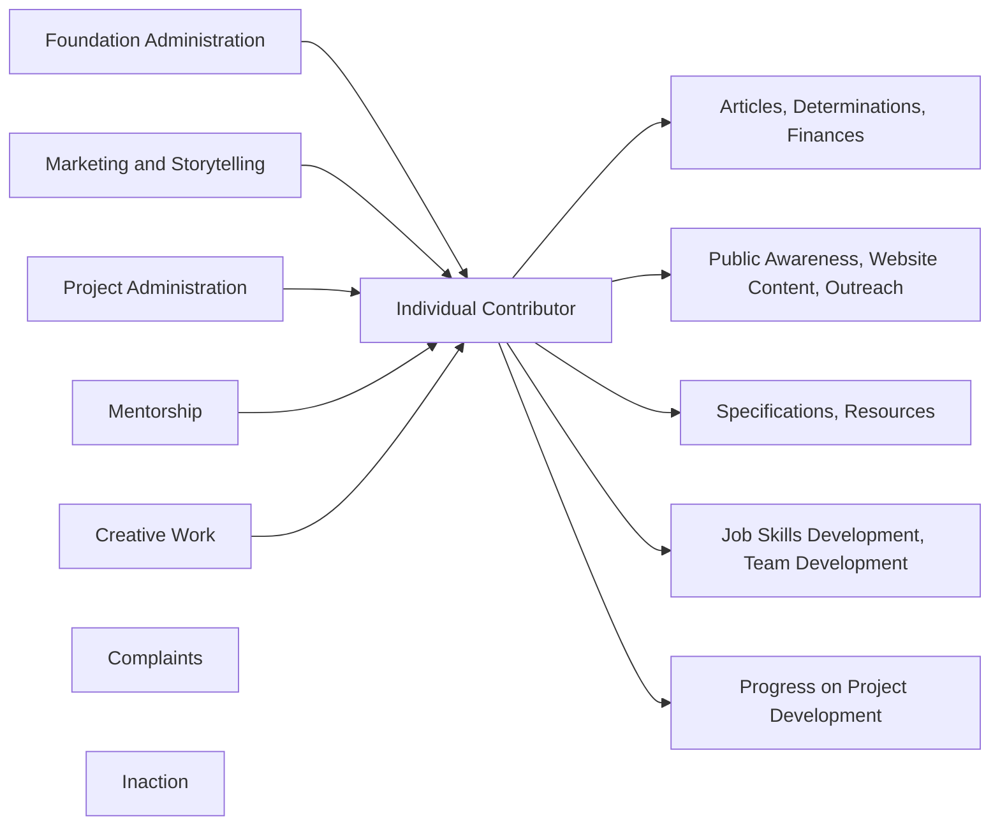

<!--
 Copyright (C) 2022 Code for Vegas Foundation
 
 This file is part of doc-cfv-howtos.
 
 doc-cfv-howtos is free software: you can redistribute it and/or modify
 it under the terms of the GNU General Public License as published by
 the Free Software Foundation, either version 3 of the License, or
 (at your option) any later version.
 
 doc-cfv-howtos is distributed in the hope that it will be useful,
 but WITHOUT ANY WARRANTY; without even the implied warranty of
 MERCHANTABILITY or FITNESS FOR A PARTICULAR PURPOSE.  See the
 GNU General Public License for more details.
 
 You should have received a copy of the GNU General Public License
 along with doc-cfv-howtos.  If not, see <http://www.gnu.org/licenses/>.
-->

# Volunteering Your Time

Volunteering for anything is always a challenge. The rewards are often self-actualized, ideally as a result of helping others, and this is an important part of what we are attempting to accomplish.

Externally, and mostly for legal reasons, there are roles without this Foundation such as President and Director, required for the formation of a Nonprofit Corporation and for receiving a 501(c)(3) public charity determination from the IRS, among other things (and there are multiple other things). Internally, however, our Foundation is organized as a non-hierarchy, where no one individual works for any other individual. There are those who will take leadership roles when appropriate, perhaps based on time availability, a particular expertise that applies to some project or project component, or perhaps a desire to drive a particular component directly. At the same time, some will participate in various ways when they can, and so it is possible a specific leadership role will migrate from one person to another, perhaps based on time, or on a particular issue, or other factors.

Do projects *require* management infrastructure? Is there a need for a *managerial hierarchy* or other specific infrastructure? Perhaps. When there are individuals willing to take on those roles, it will be a worthwhile consideration, especially as project participation grows with time. In a startup scenario, it is often up to individual contributors to take leadership roles, if temporarily, to advance a project or particular issue.

One of the primary goals of our Foundation, from an operational perspective, is to transparently attribute volunteer effort (contribution of creative work or other activities) to volunteers, so that anyone curious can find out easily who is making a difference. The resulting development of job skills and the elevation of our communities at large through our efforts will, if all goes to plan, bring that self-actualized reward.

## Entrepreneurialism and Collaboration

There are two critical components to volunteering your time for our various projects and activities:

You should be [Entrepreneurial](https://www.dictionary.com/browse/entrepreneurial) or at least be willing to consider this approach to endeavors. Taking initiative to do something that needs to be done without waiting for others to do it for you, will be a job skill, and a life skill, that you can take with you anywhere. Many will believe this term is used to describe someone who is starting a business, and it is, but this quality is *also* found in people who make things happen.

You should be willing to Collaborate, or work together, to accomplish goals, learn, and teach, share, and succeed. If collaboration on projects is something you are not used to doing, all of our projects and activities will benefit from collaboration, and you can become comfortable doing so along the way. Sometimes collaboration is made easier with tools like GitHub or Figma or Discord or other tools, but it starts with an attitude that *team* has real value starting with one individual valuing the efforts of another.

The practiced abilities to identify a contribution one can make to a project, to work with members of a team to coordinate the collaboration, and then execute that contribution to advance the project, are invaluable, not only to the projects and others on your team(s), but to you.

## The Critical Path

A somewhat infamous project management method, the Program Evaluation and Review Technique [PERT](https://en.wikipedia.org/wiki/Program_evaluation_and_review_technique), was used to manage and complete the Polaris Submarine program in 1958. The methodologies are worth looking at for time estimation per project component, but there is one element of PERT that is worth considering in the context of volunteer effort.

The [Critical Path Method](https://en.wikipedia.org/wiki/Critical_path_method) has history and evolved mathematical elements that are worth additional reading and research if you are inclined toward project and program management, but the Critical Path is an essential consideration when working on volunteer projects in particular.

Let us examine a contrived example of how this Foundation functions, possibly in a sub-optimal way:

The *Individual Contributor* is on the *Critical Path* for most, if not all tasks required for the Foundation to function. If there is only one single Individual Contributor, all tasks will be delayed as the one individual attempts to complete them. A team of one is a real challenge!

As illustrated here, Complaining and Inaction play no part in any project and do not in any way assist the Individual Contributor.

How can we avoid the bottleneck of a single Individual Contributor on the Critical Path? We divide the tasks and projects among multiple *entrepreneurial* individual contributors, working as part of teams, collaborating to advance one or more project components. A team of many is still a challenge, but progress is much more realistic with productive collaboration.

## Volunteer Effort Is Gold

And so we let it shine!

If you are new to volunteering your time and efforts to Open Source projects (which are typically thought of as only software or coding projects, but no, this is not the case), there are many benefits that you will realize over time, stated very usefully and expansively in the link below. Before you click away to read over this useful guide, please keep these specific things in mind with regard to this Foundation:

* Job Skills Development is a primary goal
* Community Elevation is a primary goal
* Our purpose is to Enable and Encourage Ideation, Innovation, and Implementation to make our communities better… this is our legally-published purpose which embodies the first two bullet items.

How we accomplish these is not a matter of a startup business plan receiving venture capital funding to deliver products or services. This is a group effort, powered by volunteers like you, working with other volunteers like you, in ways that may not be immediately obvious. Please take a moment and read through this external document below if you need some ideas how to volunteer your time and effort to our open source projects and goals:

[Open Source Guide: How to Contribute](https://opensource.guide/how-to-contribute/)

Maintaining and adding to our own Howto documents, one of which you have read right here, is just one of many, many ways you can volunteer your time and effort with this Foundation and your peers…
